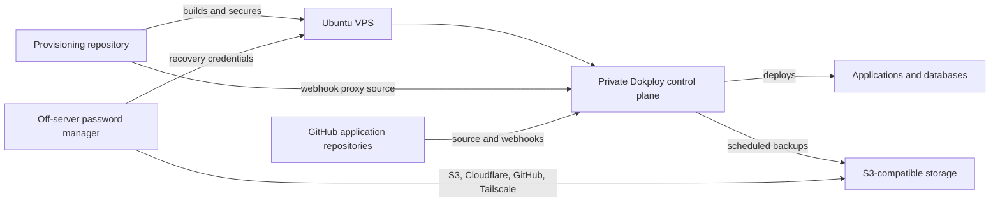
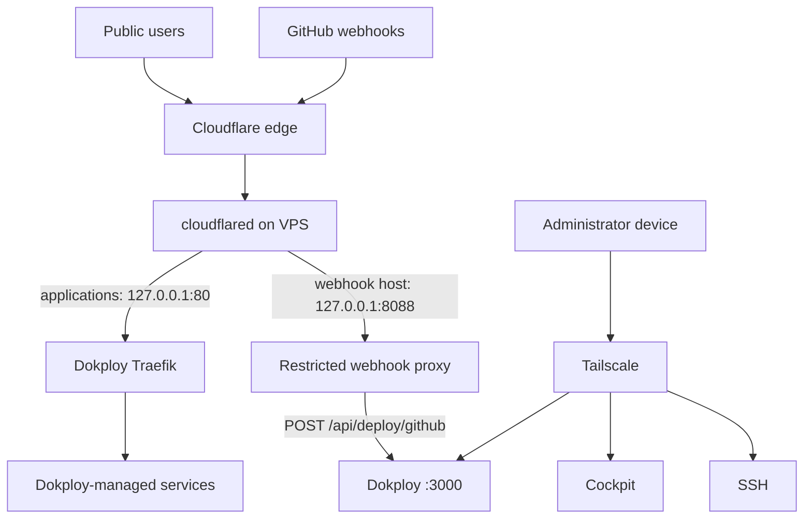
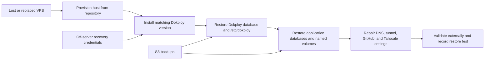

# Architecture

## Ownership model

The repository owns host provisioning and the proxy's source configuration.
Dokploy owns application and Compose deployment state, including deployment of
the proxy, plus configuration, domains, and backup schedules. Keeping a second
deployment mechanism here would create two control planes with ambiguous
precedence.

## Network design

Traefik and the proxy bind only to loopback. Administrative services are
reachable through Tailscale. The VPS provider firewall and host firewall form
additional layers rather than the primary public application path.

## Recovery design

The S3 destination cannot be the only place where its own credentials are
stored. Credentials, account recovery methods, the last known Dokploy version,
and the repository commit must remain available off-server.
